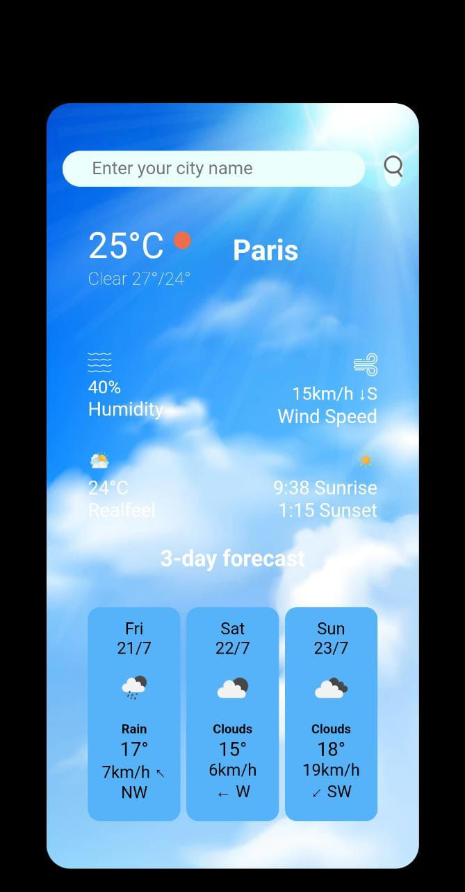

# Weather App 🌦️
 
Hosted link :-https://dubey123459.github.io/weather-app-internsavy/

Welcome to the Weather App project! This web application allows users to check real-time weather conditions with your <b>Current location </b>and also for any location in the world. With a simple and intuitive interface, users can get up-to-date weather information with just a few clicks.

  

<h2>Demo</h2>
You can experience a live demo of the Weather App by visiting this link :-https://dubey123459.github.io/weather-app-internsavy/

<h2>Features</h2>

<b>Current Weather☔ :</b> Get the latest weather data for any city or location.

<b>Forecast:</b> Three days forecast weather is also available.

<b>Weather background image :</b>For better user experience you can see the changing your background image automatically like if there night in city then and cloudy it will show you clouds and night.

<b>Audio🔉:</b> With the changes of weather in rain☔ or thunderstorm⚡ sound will play.

<b>Weather Icon☀️ :</b> Visual representation of the weather conditions (e.g., sun, rain, clouds).

<b>Temperature🌡️ :</b> View the current temperature in Celsius.

<b>Current location 📍 :</b>It will take automatically take your current location just you need to allow only.

<b>Humidity☁:</b> Check the humidity percentage in the air.

<b>Wind Speed💨:</b> Find out the wind speed in km/h.

<b>Responsive Design:</b> Access the app seamlessly on different devices - desktop, tablet, or mobile.

<h2>Technologies Used</h2>
The Weather App is built using the following technologies:

1:- HTML5: For the structure of the web page.

2:- CSS3: To style and design the user interface.

3:-JavaScript: To add interactivity and fetch weather data from the API.

Enter the name of the city name in the search input.

Click the "Search"  button to fetch and display the weather data.

<h2>Acknowledgments</h2>
Special thanks to OpenWeatherMap for providing the weather data API.

We would like to express our gratitude to all the developers and contributors whose work helped build the technologies used in this project.

<h2>License</h2>
The Weather App is licensed under the MIT License. Feel free to use, modify, and distribute the code as per the terms of the license.

Let us know if you encounter any issues or have suggestions for improvements. Happy weather checking! 🌞🌧️🌈
